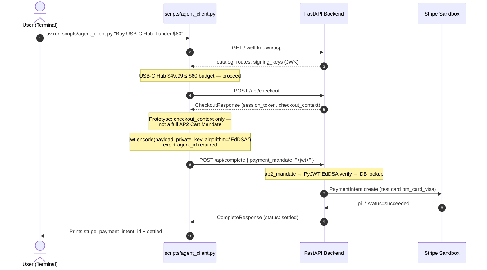
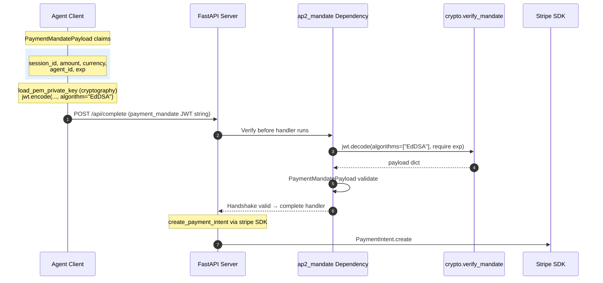
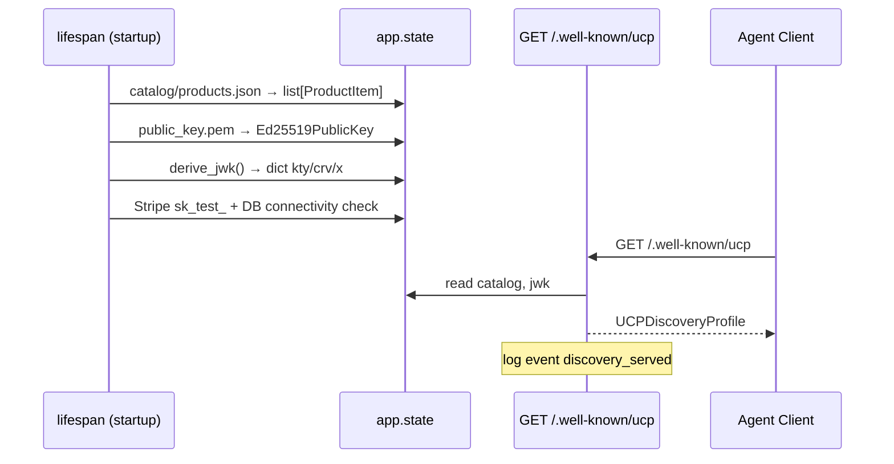
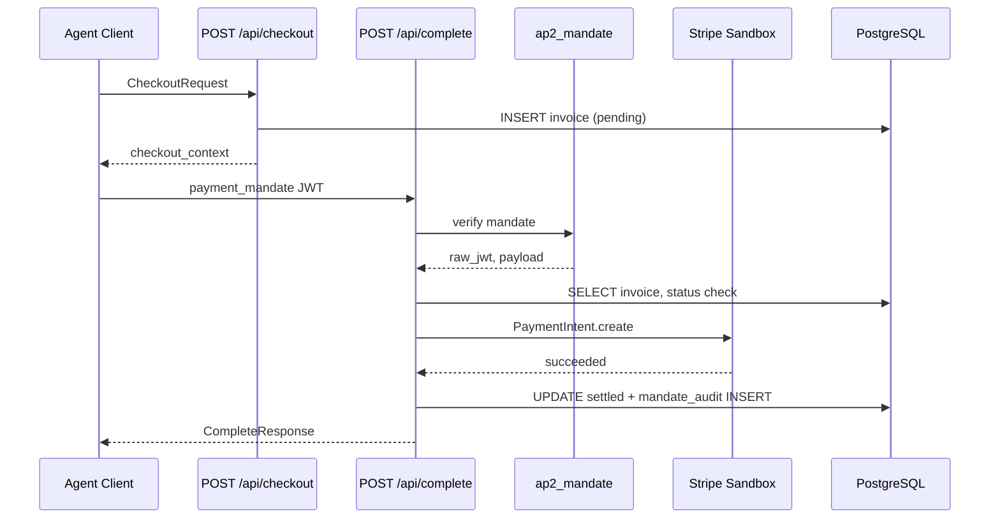

# Story 6.1: Post-Sprint Architecture Documentation and Reference Guides

Status: done

<!-- Note: Validation is optional. Run validate-create-story for quality check before dev-story. -->

## Story

As a developer or system reviewer joining after the MVP sprint,
I want protocol visual mappings, open-standard reference links, and a backend architecture runbook,
So that I can understand how this prototype maps to AP2/UCP industry standards and why specific typing and crypto choices were made in the codebase.

## Acceptance Criteria

**Given** a reader opens `docs/architecture/diagrams.md`
**When** they review all four sequence diagrams
**Then** Diagram 1 (End-to-End Agent Purchase) shows the full UJ-1 terminal flow using `scripts/agent_client.py` and real catalog items
**And** Diagram 2 (Payment Mandate Cryptographic Handshake) zooms into EdDSA signing and PyJWT verification before Stripe
**And** Diagram 3 (Server Startup & UCP Discovery) maps lifespan initialization through `GET /.well-known/ucp`
**And** Diagram 4 (Settlement Pipeline) shows checkout → mandate → Stripe → DB as an internal technical view
**And** user-provided narrative diagrams are included with codebase-accurate corrections (see Modifications table below)

**Given** a reader opens `docs/architecture/protocol-references.md`
**When** they scan the mandatory links section
**Then** verified links are present for:
- Official AP2 Repository: https://github.com/google-agentic-commerce/AP2
- Universal Commerce Protocol Spec Hub: https://ucp.dev/
- Google Codelab: Secure Agent Commerce with AP2 and UCP (https://codelabs.developers.google.com/next26/adk-agent-commerce)
**And** each link includes a one-line description of why it matters to this project

**Given** a reader opens `docs/README-ARCH.md`
**When** they read the Type Strategy Rationale section
**Then** it explains why `catalog` is `list[ProductItem]` (strict Pydantic validation at load) while `app.state.jwk` is a raw `dict[str, str]` from `derive_jwk()` (RFC 8037 primitive map, no nested Pydantic coupling at state layer)
**And** the Cryptographic Blueprint section documents unpadded urlsafe base64 encoding in `derive_jwk()` matching RFC 8037 JWK `x` field rules
**And** the Testing Mechanics section explains how `tests/test_state_init.py` and `scripts/agent_client.py` use local ephemeral Ed25519 key pairs to simulate agent interactions without production keys

**And** no application Python code is modified (documentation-only story)
**And** `README.md` includes a short pointer to `docs/README-ARCH.md` and `docs/architecture/`

## Tasks / Subtasks

- [x] T1: Create `docs/architecture/diagrams.md` with four Mermaid diagrams (user E2E + mandate zoom + startup discovery + settlement pipeline) and correction captions
- [x] T2: Create `docs/architecture/protocol-references.md` with verified mandatory links and project-relevance notes
- [x] T3: Create `docs/README-ARCH.md` with Type Strategy Rationale, Cryptographic Blueprint, and Testing Mechanics sections
- [x] T4: Update `README.md` with Documentation section linking to `docs/README-ARCH.md` and `docs/architecture/diagrams.md` (~5 lines, no playbook relocation)
- [x] T5: Manual validation — verify Mermaid syntax renders, links resolve, code citations match `crypto.py`, `schemas.py`, `test_state_init.py`, `agent_client.py`

### Review Findings

- [x] [Review][Patch] Diagram 1: clarify `pm_card_visa` is a PaymentMethod ID, not a PaymentIntent ID [docs/architecture/diagrams.md:40]
- [x] [Review][Patch] Diagram 4 caption: `mandate_audit` stores SHA-256 hash of JWT, not raw token [docs/architecture/diagrams.md:168]
- [x] [Review][Patch] README-ARCH: `ed25519_key_pair` fixture scope is function (default), not session [docs/README-ARCH.md:100]
- [x] [Review][Patch] Diagram 2: document JWT format check (step 2) before EdDSA verify in `ap2_mandate` [docs/architecture/diagrams.md:81]
- [x] [Review][Patch] Diagram 4: checkout response includes `session_token` + `checkout_context` [docs/architecture/diagrams.md:153]
- [x] [Review][Patch] Diagram 4: note `session.commit()` closes read transaction before Stripe call [docs/architecture/diagrams.md:158]
- [x] [Review][Patch] README-ARCH: remove user-facing link to `_bmad-output/` path [docs/README-ARCH.md:134]
- [x] [Review][Defer] README Method B (ssh-keygen) produces OpenSSH public key, not PEM — server cannot load [README.md:76] — deferred, pre-existing (not introduced by story 6.1)
- [x] [Review][Defer] No production key rotation / multi-worker deployment docs — deferred, out of prototype scope

---

## Developer Context

### Scope Boundary — THREE DELIVERABLES ONLY

| Task | File | Action |
|---|---|---|
| Task 1 | `docs/architecture/diagrams.md` | CREATE |
| Task 2 | `docs/architecture/protocol-references.md` | CREATE |
| Task 3 | `docs/README-ARCH.md` | CREATE |
| Pointer | `README.md` | UPDATE — minimal links only |

**Do NOT create** the generic docs from the prior story draft (`docs/api-reference.md`, `docs/index.md`, etc.) unless explicitly added in a future story.

**Do NOT modify** `app/`, `tests/`, `scripts/`, Docker, or env files.

### Prototype vs Full AP2/UCP (BINDING context for diagrams)

This backend is a **simplified merchant/verifier prototype**, not a full AP2 reference implementation:

| Full spec concept | This prototype |
|---|---|
| CartMandate + PaymentMandate (SD-JWT+kb) | Payment Mandate JWT only (`payment_mandate` body field) |
| MCP/A2A transport | REST only (`httpx` / FastAPI) |
| `dev.ucp.shopping.ap2_mandate` extension flow | Capability declared; minimal mandate payload |
| Merchant-signed checkout JWT | `CheckoutResponse` with `checkout_context` (no CartMandate) |

Diagrams and README-ARCH must **label prototype simplifications** so readers do not assume full Google codelab parity.

### User-Provided Diagrams — Required Modifications

These diagrams are **included in Story 6.1** with the corrections below. Do not use fictional catalog items or wrong script names.

| Original (user draft) | Correction (as-built codebase) |
|---|---|
| `client_sim.py` | `scripts/agent_client.py` |
| "Premium Tech Jacket" at $85 | Use **USB-C Hub** at **$49.99** (catalog `prod_003`) or **Wireless Headphones** at **$79.99** — no jacket in `catalog/products.json` |
| "Returns session ID & Cart Mandate" | Returns `CheckoutResponse` with `checkout_context` — **prototype does not issue AP2 CartMandate** |
| Mandate JSON only `session_id`, `amount`, `currency` | Add **`agent_id`** and **`exp`** (server rejects JWT without `exp`) |
| "signs JSON using cryptography package" | Load private key via **`cryptography`**; sign JWT via **`PyJWT`** `jwt.encode(..., algorithm="EdDSA")` |
| Server verifies via PyJWT only | `ap2_mandate` Dependency → `crypto.verify_mandate()` → then handler → Stripe |

---

## Technical Requirements

### Task 1: `docs/architecture/diagrams.md` (T1)

**File header:** Brief intro — four views of the same prototype: user journey, crypto zoom, boot-time discovery, and internal settlement. Label prototype simplifications vs full AP2/UCP codelab.

**Suggested `diagrams.md` outline:**

```markdown
# Protocol Visual Mappings

1. [End-to-End Agent Purchase](#diagram-1-end-to-end-agent-purchase) — terminal demo flow
2. [Payment Mandate Cryptographic Handshake](#diagram-2-payment-mandate-cryptographic-handshake) — zoom on POST /api/complete
3. [Server Startup & UCP Discovery](#diagram-3-server-startup--ucp-discovery) — lifespan → app.state
4. [Settlement Pipeline (Internal)](#diagram-4-settlement-pipeline-internal) — technical call order
```

---

#### Diagram 1 — End-to-End Agent Purchase (USER DIAGRAM — corrected)

**Title:** UJ-1 Terminal Demo — Discovery Through Settlement

**Source:** User-provided narrative diagram. **Use this as the primary onboarding visual** in `diagrams.md`.



**Caption bullets:**
- Real script path: `scripts/agent_client.py` (not `client_sim.py`)
- Example product matches `catalog/products.json` (`USB-C Hub`, $49.99)
- Checkout returns `checkout_context.total_amount` used in mandate `amount` field
- Stripe charge is sandbox-only (`sk_test_` gate at startup)

---

#### Diagram 2 — Payment Mandate Cryptographic Handshake (USER DIAGRAM — corrected)

**Title:** EdDSA Payment Mandate — Sign, Verify, Settle

**Source:** User-provided crypto zoom diagram. Placed **after** Diagram 1 as a drill-down on step 3.



**Caption bullets:**
- Signing uses **both** `cryptography` (key load) and **PyJWT** (JWT construction) — not cryptography alone
- Verification never calls PyJWT from routers — only `app/services/crypto.py`
- Mandate rejection logs: `mandate_rejected` with `reason`, `ip`

---

#### Diagram 3 — Server Startup & UCP Discovery

**Title:** Boot-Time State Initialization (before any client call)



**Map to code:** `app/main.py`, `app/routers/discovery.py`, `app/services/crypto.py`

---

#### Diagram 4 — Settlement Pipeline (Internal)

**Title:** Checkout → Mandate → Stripe → PostgreSQL (technical call order)



**Caption:** Complements Diagram 1–2 with DB and dependency participants explicit.

---

### Task 2: `docs/architecture/protocol-references.md` (T2)

Structure:

```markdown
# Open Standard Reference Guide

Verified external references for the protocols this prototype implements.

## Mandatory Links

| Resource | URL | Relevance to this repo |
|---|---|---|
| AP2 Repository | https://github.com/google-agentic-commerce/AP2 | Open-source AP2 schemas, Python SDK models, reference client structures |
| UCP Spec Hub | https://ucp.dev/ | Industry-neutral UCP rules (Google, Shopify, Stripe, Walmart co-authors) |
| Secure Agent Commerce Codelab | https://codelabs.developers.google.com/next26/adk-agent-commerce | End-to-end UCP discovery + AP2 mandate walkthrough |

## Related Specifications (optional but useful)

| Resource | URL | Notes |
|---|---|---|
| UCP AP2 Mandates Extension | https://ucp.dev/latest/specification/ap2-mandates/ | How UCP negotiates `dev.ucp.shopping.ap2_mandate` |
| AP2 Specification (markdown) | https://github.com/google-agentic-commerce/AP2/blob/main/docs/ap2/specification.md | Payment vs Checkout Mandate definitions |
| Google UCP Merchant Guide | https://developers.google.com/merchant/ucp | Merchant adoption context |

## How This Prototype Maps

Short paragraph: REST transport, `/.well-known/ucp` discovery, `dev.ucp.shopping.checkout` + `dev.ucp.shopping.ap2_mandate` capabilities, simplified PaymentMandate JWT (not full SD-JWT+kb stack from codelab).
```

**Verification:** Open each mandatory URL during T5; do not link to moved/404 targets.

---

### Task 3: `docs/README-ARCH.md` (T3)

Backend Developer Integration Runbook — required sections:

#### Section A: Type Strategy Rationale

Explain the **dual typing pattern** in this codebase:

1. **`list[ProductItem]` for catalog** (`app/models/schemas.py`, loaded in lifespan):
   - Catalog JSON from disk is validated at startup via `ProductItem.model_validate()`
   - Strict fields: `id`, `name`, `price`, `currency` — rejects malformed catalog before serving traffic
   - Served inline in UCP discovery response as typed catalog array
   - **Why strict:** catalog is business data consumed by agents; validation errors must fail fast at boot

2. **`dict[str, str]` for JWK in `app.state.jwk`** (`crypto.derive_jwk()` return type):
   - JWK is a **cryptographic primitive map** (`kty`, `crv`, `x`) per RFC 8037
   - Stored as plain dict in `app.state` after derivation — no nested Pydantic object in state
   - Discovery handler wraps with `JWK.model_validate(request.app.state.jwk)` only at response boundary
   - **Why dict at state layer:** avoids coupling lifespan/crypto layer to FastAPI/Pydantic response models; `derive_jwk()` is a pure crypto utility returning RFC-shaped data
   - **Contrast:** `ProductItem` is domain catalog data; JWK dict is encoding output from `cryptography` key material

Cite: `app/services/crypto.py:31-38`, `app/main.py:98`, `app/routers/discovery.py` (`JWK.model_validate`)

#### Section B: Cryptographic Blueprint

Document `derive_jwk()` explicitly:

```python
raw = public_key.public_bytes(encoding=Encoding.Raw, format=PublicFormat.Raw)
x = base64.urlsafe_b64encode(raw).rstrip(b"=").decode("ascii")
return {"kty": "OKP", "crv": "Ed25519", "x": x}
```

Explain:
- Ed25519 raw public key is **32 bytes**
- RFC 8037 JWK `x` uses **base64url encoding without padding** (`rstrip(b"=")`)
- Tests enforce: no `+`, `/`, or `=` in `x` (`tests/test_state_init.py::test_derive_jwk_x_is_base64url`)
- Mandate verification: `jwt.decode(..., algorithms=["EdDSA"], options={"require": ["exp"]})`
- Mandate signing (client): `jwt.encode(payload, private_key, algorithm="EdDSA")` with `exp` claim
- **Key separation:** server never reads `private_key.pem`; agent client never reads server verification logic

#### Section C: Testing Mechanics

Document the **isolated cryptographic test loop**:

1. **`tests/conftest.py::ed25519_key_pair` fixture**
   - Generates ephemeral Ed25519 key pair per test session
   - No dependency on `keys/` directory for unit tests
   - Returns `(private_key, public_key, public_pem_bytes)`

2. **`tests/test_state_init.py`**
   - Unit tests for `load_public_key()` and `derive_jwk()` against fixture keys
   - Lifespan catalog loading tests with mocked file I/O and patched `derive_jwk`
   - Validates JWK shape matches what discovery serves
   - Proves base64url compliance independent of live server

3. **`scripts/agent_client.py`**
   - Standalone script — **never imports `app/`**
   - Loads `keys/private_key.pem` from disk at signing step (local dev/demo)
   - Signs mandate with same EdDSA algorithm as tests
   - Full HTTP loop against running server simulates Google-compliant agent behavior

4. **Integration vs unit split**
   - Router tests: ASGITransport + mocked DB/Stripe (`test_complete.py`, `test_crypto.py`)
   - DB integration: real Postgres via `TEST_DATABASE_URL` (`test_db_integration.py`)
   - Crypto path coverage: FR-16 cases in `test_crypto.py` including mandate rejection logs

**Narrative:** Tests and agent client together demonstrate the full handshake → sign → verify → settle loop without requiring Google's reference SDK — aligned with AP2 intent but prototype-scoped.

---

### README Update (T4)

Add after intro paragraph:

```markdown
## Architecture Documentation

- [Backend Architecture Runbook](docs/README-ARCH.md) — typing strategy, crypto blueprint, test mechanics
- [Protocol Diagrams](docs/architecture/diagrams.md) — E2E agent flow, mandate handshake, discovery, and settlement pipeline
- [Open Standard References](docs/architecture/protocol-references.md) — AP2, UCP, Google codelab links
```

Do not duplicate runbook content into README.

---

## File Structure Requirements

```
docs/
  README-ARCH.md
  architecture/
    diagrams.md
    protocol-references.md
README.md          # minimal Documentation section only
```

---

## Testing Requirements

**No pytest changes.** T5 manual validation:

- [x] Mermaid blocks in `diagrams.md` are syntactically valid (all four diagrams)
- [x] Diagram 1 uses `scripts/agent_client.py` and real catalog product (USB-C Hub $49.99)
- [x] Diagram 2 documents `agent_id` + `exp` mandate claims
- [x] No reference to "Cart Mandate" without prototype disclaimer
- [x] All three mandatory protocol URLs load successfully
- [x] `derive_jwk` code citation matches `app/services/crypto.py` lines 31-38
- [x] `ProductItem` vs `dict` JWK explanation matches actual `app.state` usage
- [x] References to `test_state_init.py` and `agent_client.py` match current file behavior

---

## Previous Story Intelligence

### Story 5.3 — README is onboarding; this story is architecture depth

- README playbook stays in `README.md`
- Logging event names documented in Story 5.3 — cross-reference in Diagram 2 captions only

### Story 5.2 — Agent client patterns

- `scripts/agent_client.py` uses `jwt.encode(..., algorithm="EdDSA")` with `exp`
- Document in README-ARCH Testing Mechanics section

### Epic 5 complete — all FRs delivered

This post-sprint story is **maintainer/reviewer enablement**, not in original `epics.md`.

---

## Git Intelligence Summary

- Baseline `83dba26`; Epic 5 work may exist uncommitted locally
- Read **current** `crypto.py`, `schemas.py`, `agent_client.py`, `test_state_init.py` when writing docs
- `derive_jwk` returns `dict[str, str]` — central to Type Strategy section

---

## Architecture Compliance

| Topic | Doc location |
|---|---|
| UCP discovery `/.well-known/ucp` | Diagram 3 |
| AP2 mandate EdDSA verify | Diagram 2, Diagram 4 |
| E2E agent demo flow | Diagram 1 |
| RFC 8037 JWK `x` encoding | README-ARCH Cryptographic Blueprint |
| Component boundaries | Diagram captions + README-ARCH |
| External spec links | protocol-references.md |

---

## Project Context Reference

- [app/services/crypto.py](app/services/crypto.py) — `derive_jwk`, `verify_mandate`
- [app/models/schemas.py](app/models/schemas.py) — `ProductItem`, `JWK` response model
- [app/main.py](app/main.py) — lifespan state initialization
- [tests/test_state_init.py](tests/test_state_init.py) — JWK/catalog startup tests
- [scripts/agent_client.py](scripts/agent_client.py) — live agent simulation
- [architecture.md](_bmad-output/planning-artifacts/architecture.md) — planning context (verify against code)
- [deferred-work.md](_bmad-output/implementation-artifacts/deferred-work.md) — prototype limitations (optional footnote in README-ARCH)

---

## References

- [Source: user task spec] — three deliverables: diagrams, protocol-references, README-ARCH
- [Source: crypto.py derive_jwk] — base64url without padding
- [Source: schemas.py] — ProductItem vs JWK model boundary
- [Source: AP2 repo](https://github.com/google-agentic-commerce/AP2)
- [Source: UCP hub](https://ucp.dev/)
- [Source: Google codelab](https://codelabs.developers.google.com/next26/adk-agent-commerce)

---

## Dev Agent Record

### Agent Model Used

Composer (Cursor)

### Debug Log References

None

### Completion Notes List

- Created `docs/architecture/diagrams.md` with four Mermaid sequence diagrams: E2E agent purchase (user diagram corrected), mandate crypto handshake (user diagram corrected), server startup/discovery, and internal settlement pipeline
- Created `docs/architecture/protocol-references.md` with three mandatory verified links (HTTP 200) plus related specs and prototype mapping paragraph
- Created `docs/README-ARCH.md` with Type Strategy Rationale, Cryptographic Blueprint, and Testing Mechanics sections citing current code
- Added Architecture Documentation section to README.md (3 links, no playbook relocation)
- Documentation-only story — no `app/`, `tests/`, or `scripts/` changes
- Unit tests: 100 passed (no regressions)
- Code review: 7 patch findings applied (diagram accuracy, fixture scope, internal path link removed)

### File List

- `docs/architecture/diagrams.md` (new, review patches applied)
- `docs/architecture/protocol-references.md` (new)
- `docs/README-ARCH.md` (new, review patches applied)
- `README.md` (modified)

### Change Log

- 2026-06-28: Code review patches — diagram accuracy (pm_card_visa, mandate hash, JWT format check, session commit, session_token)

---

## Story Completion Status

- Status: done
- Story includes user-provided Mermaid diagrams (corrected) as Diagrams 1–2; technical Diagrams 3–4 retained
