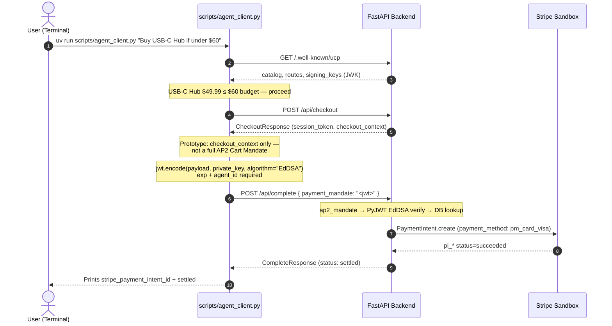
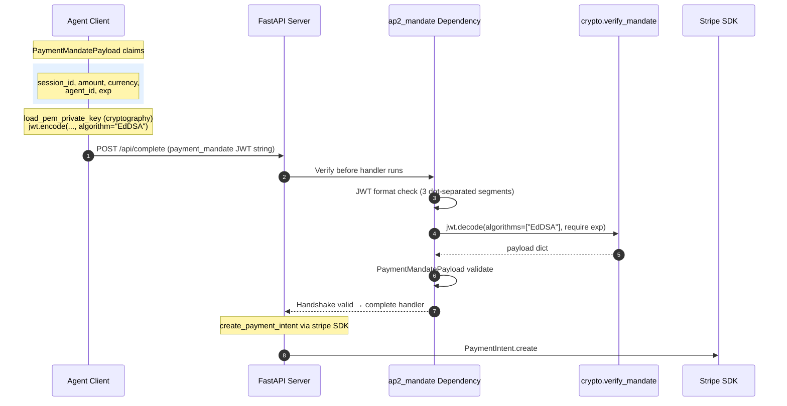
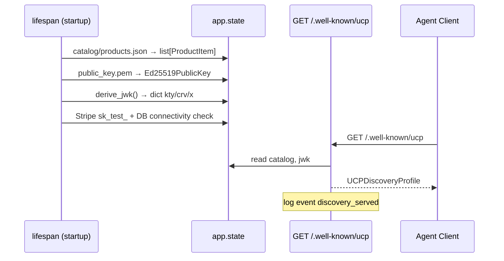
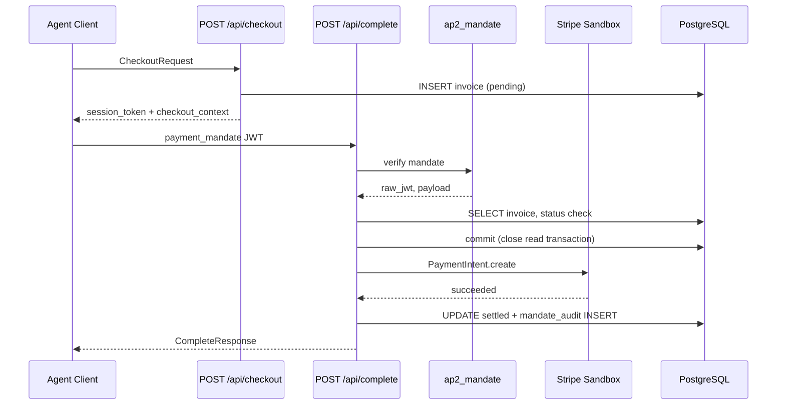

# Protocol Visual Mappings

Four views of the same prototype: terminal user journey, cryptographic mandate handshake, boot-time discovery, and internal settlement pipeline.

**Prototype scope:** This backend is a simplified merchant/verifier — REST transport, Payment Mandate JWT only (not full SD-JWT+kb CartMandate stack from the Google codelab), and `CheckoutResponse` with `checkout_context` instead of a merchant-signed Cart Mandate.

1. [End-to-End Agent Purchase](#diagram-1-end-to-end-agent-purchase) — terminal demo flow
2. [Payment Mandate Cryptographic Handshake](#diagram-2-payment-mandate-cryptographic-handshake) — zoom on `POST /api/complete`
3. [Server Startup & UCP Discovery](#diagram-3-server-startup--ucp-discovery) — lifespan → `app.state`
4. [Settlement Pipeline (Internal)](#diagram-4-settlement-pipeline-internal) — technical call order

---

## Diagram 1: End-to-End Agent Purchase

**Title:** UJ-1 Terminal Demo — Discovery Through Settlement

Primary onboarding visual for the live agent purchase demo.

**Caption:**

- Real script path: `scripts/agent_client.py` (not `client_sim.py`)
- Example product matches `catalog/products.json` (`USB-C Hub`, `prod_003`, $49.99)
- Checkout returns `checkout_context.total_amount` used in mandate `amount` field
- Stripe uses sandbox `PaymentIntent` with test **PaymentMethod** `pm_card_visa` (not a `pi_*` ID)
- Success log on server: `settlement_success` with `session_id`, `stripe_payment_intent_id`

**Map to code:** `scripts/agent_client.py`, `app/routers/discovery.py`, `app/routers/checkout.py`, `app/routers/complete.py`

---

## Diagram 2: Payment Mandate Cryptographic Handshake

**Title:** EdDSA Payment Mandate — Sign, Verify, Settle

Drill-down on step 3 of Diagram 1 — mandate signing and verification before Stripe.

**Caption:**

- Step 2 in `ap2_mandate`: malformed JWT format (`invalid_jwt_format`) rejected before EdDSA verify
- Signing uses **both** `cryptography` (key load) and **PyJWT** (`jwt.encode`) — not cryptography alone
- Verification never calls PyJWT from routers — only `app/services/crypto.py`
- Mandate rejection logs: `mandate_rejected` with `reason`, `ip`
- Server rejects JWT without `exp` claim (`options={"require": ["exp"]}`)

**Map to code:** `app/dependencies.py`, `app/services/crypto.py`, `app/services/settlement.py`

---

## Diagram 3: Server Startup & UCP Discovery

**Title:** Boot-Time State Initialization (before any client call)

**Caption:**

- Startup loads catalog and derives JWK before serving requests (`app/main.py` lifespan)
- Discovery handler reads **only** `app.state` — no per-request disk I/O
- `signing_keys[0].x` is base64url Ed25519 material (RFC 8037)
- Capabilities: `dev.ucp.shopping.checkout`, `dev.ucp.shopping.ap2_mandate`
- Routes: `/api/checkout`, `/api/complete`

**Map to code:** `app/main.py`, `app/routers/discovery.py`, `app/services/crypto.py`

---

## Diagram 4: Settlement Pipeline (Internal)

**Title:** Checkout → Mandate → Stripe → PostgreSQL (technical call order)

Complements Diagrams 1–2 with DB and dependency participants explicit.

**Caption:**

- Invoice status transitions: `pending` → `settled` on successful Stripe charge
- Mandate audit trail stores SHA-256 hash of JWT in `mandate_audit` (raw token not persisted)
- Stripe call wrapped in `asyncio.to_thread` (sync SDK inside async handler)

**Map to code:** `app/routers/checkout.py`, `app/routers/complete.py`, `app/dependencies.py`, `app/services/settlement.py`
